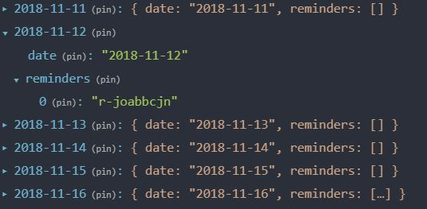

# Calendar App 

I stumbled on this coding challenge when I was browsing on [r/front_end](https://www.reddit.com/r/Frontend/). The expected completion
time was 1.5 hours, which I felt, and still do, was unreasonable. This was a great challenge to learn a lot about React and Redux,
and helped me with structuring my React code a little better than what I was initially doing. I spend a lot of time on this app,
and ignored the 1.5 hours because I really wanted to learn/understand how Redux works with React in a more practical sense. 

Side note: My app is heavily influenced by Google's Calendar App, and I have no shame. Google's calendar app is amazing, and I wanted
to pay homage to their app. 

## Getting Started

### Installing

1. Navigate to [repo](https://github.com/theboynextdoor/calendar-app) 
2. Clone repo locally:
`git clone https://github.com/theboynextdoor/calendar-app.git`
3. Install dependencies (yarn works too): 
`npm install` 
4. Start your server:
`npm start`
5. Navigate to app in [browser](http://localhost3000)

## Feature Requirements
*Ability to add a new "reminder" (max 30 chars) for a user entered day and time
*Display reminders on the calendar view in the correct time order
*Allow the user to select a colour when creating a reminder and display it appropriately
*Properly handle overflow when multiple reminders appear on the same date
*Ability to edit reminders – including changing text, day and time & colour
*Ability to delete reminders

## Bonus Features 
Validate user input when creating a reminder

## State 

### Reminder's state stored inside Redux

### Day's state stored inside Redux

## Built With

[React JS](https://reactjs.org/)
[Redux](https://redux.js.org)
[Uniqid](https://www.npmjs.com/package/uniqid)
[date-fns](https://date-fns.org/)
[React Redux](https://react-redux.js.org/)
[Webpack](https://webpack.js.org)
[Babel](https://babeljs.io)
